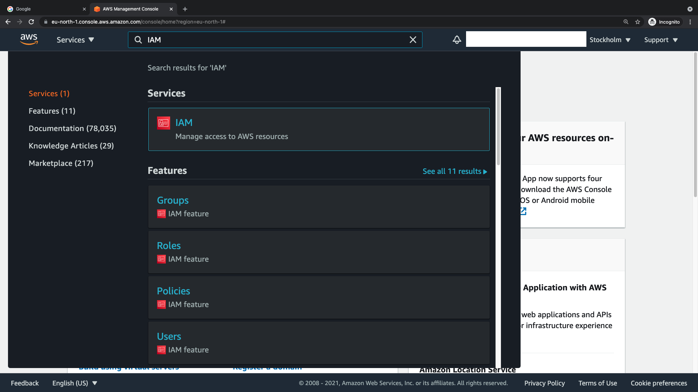
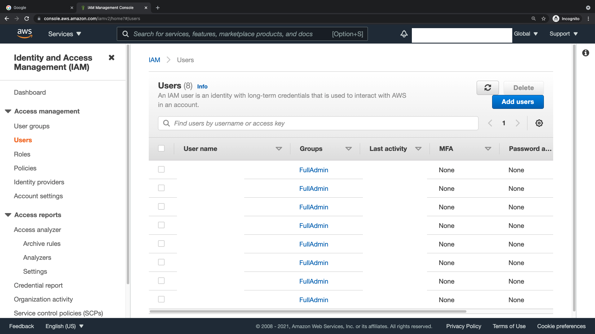
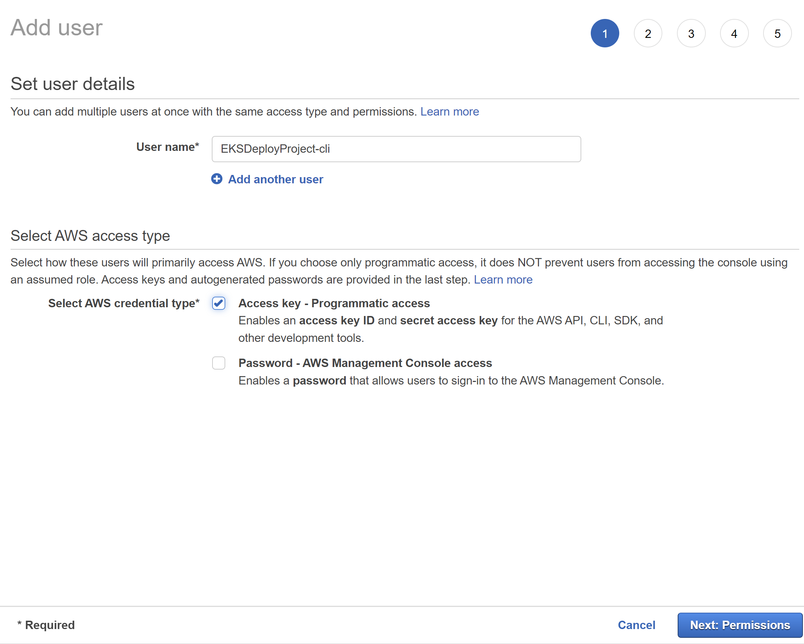
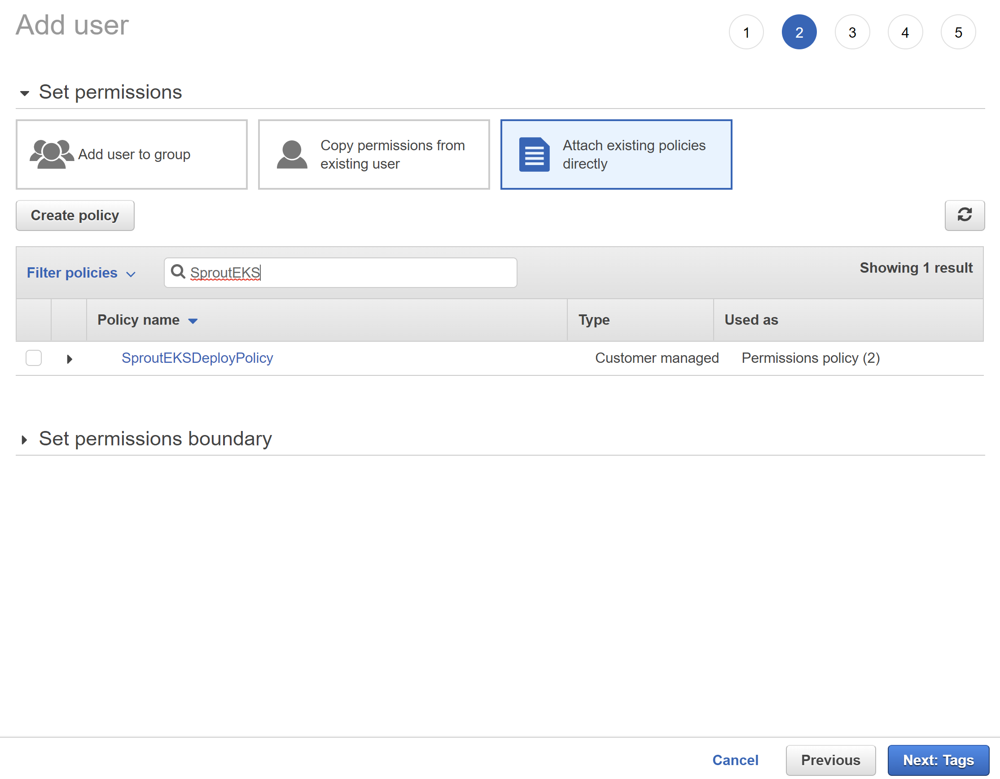
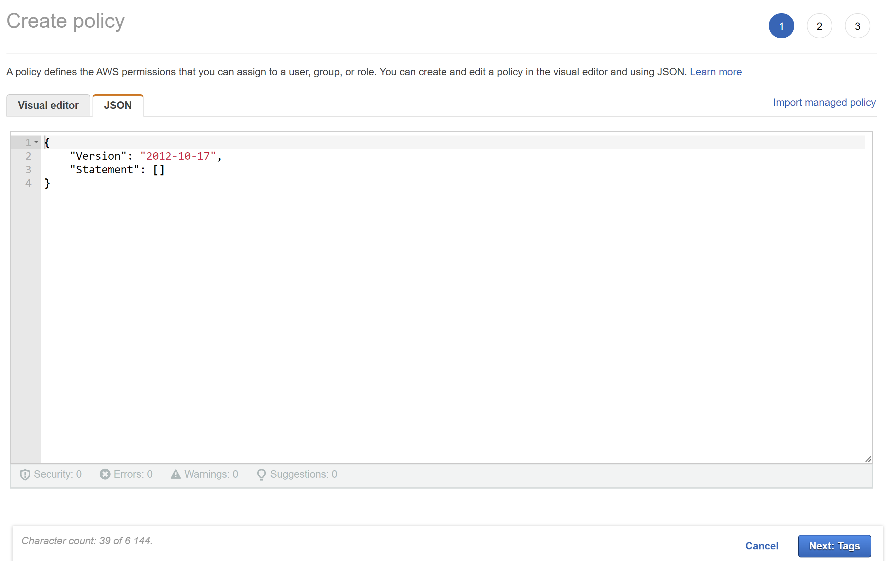
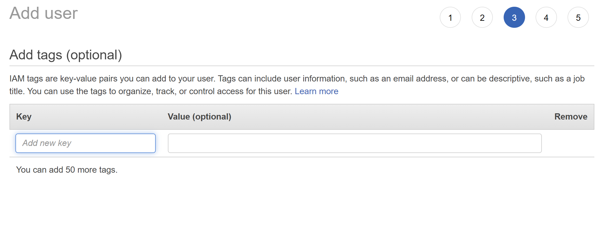
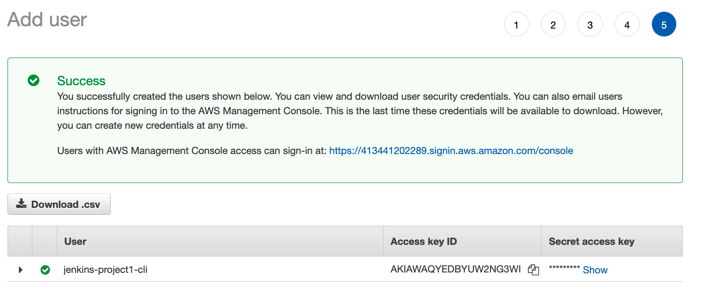

# AWS EKS Deploy template

The AWS EKS deploy template is a template for deploying apps to AWS EKS using a custom Docker registry or AWS ECR. Grafana monitoring can also be automatically deployed.

## Contents

- [Requirements from the application template for automatic Helm deployment](#requirements-from-the-application-template-for-automatic-helm-deployment)
- [EKS Deploy template](#eks-deploy-template)
    - [Contents](#contents)
    - [Technologies used](#technologies-used)
    - [Publishing to Kubernetes](#publishing-to-kubernetes)
      - [Getting Started - Automatic Deployment](#getting-started---automatic-deployment)
  - [Manual Deployment and Detailed Explanation](#manual-deployment-and-detailed-explanation)
    - [Architecture](#architecture)
    - [Pre-requisites for manual deployment:](#pre-requisites-for-manual-deployment)
      - [Cluster creation](#cluster-creation)
    - [Docker registry](#docker-registry)
    - [Deploy](#deploy)
  - [Setting up Jenkins Manually](#setting-up-jenkins-manually)
  - [Teardown of resources after automatic or manual deployment](#teardown-of-resources-after-automatic-or-manual-deployment)
  - [Logging and Monitoring](#logging-and-monitoring)
  - [Guides](#guides)

## Requirements from the application templates for automatic Helm deployment

### General requirements

The application must use Docker, and it must have three different containers: backend, database and frontend. Three deployments are created, one for the backend, one for the database and one for the frontend.

Currently these four Kubernetes secrets are created during the deployment, which the application can utilize:
- oauth-secret:

    Secret for Facebook and Google authentication. Contains only the secrets, does not have the IDs. Only passed to the backend. The environment variables are filled with values set in Sprout.
    Environment variables included:
    - FACEBOOK_APP_SECRET
    - GOOGLE_OAUTH_SECRET

- oauth-id-secret

    Secret for the IDs for Facebook and Google authentication. Passed to the backend and to the frontend. The environment variables are filled with values set in Sprout.
    Environment variables included:
    - FACEBOOK_APP_ID
    - GOOGLE_OAUTH_ID

- nodemailer-secret

    Secret for sending mail using Nodemailer. Only passed to the backend. The environment variables are filled with values set in Sprout.
    Environment variables included:
    - NODEMAILER_SMTP_HOST
    - NODEMAILER_USER
    - NODEMAILER_PASS

- postgres-secret

    Secret for authenticating to the PostgreSQL database. Passed to the backend and to the database. This secret is created automatically by Helm.
    Environment variables included:
    - POSTGRES_DB: Name of the database
    - POSTGRES_USER: Username for logging in to the database
    - POSTGRES_PASSWORD: Randomly generated 24 character alphanumeric password.
    - DATABASE_URL: URL for connecting to the database from inside the cluster. Includes the password, username and database name.

### Frontend

The application templates must specify a Docker build configuration named "frontend", that includes the frontend for the application. The frontend must be exposed on port 8000.

### Backend

The application templates must specify a Docker build configuration named "backend" that includes the backend for the application. The backend must be exposed on port 9000. The backend may communicate with the database on TCP port 5432. Ingress-nginx exposes the backend at the HTTP path /api, where the frontend can make API calls to it.

### Database

The application must specify a Docker build configuration named "database" that includes a PostgreSQL database for the application. In the secret the database's name is defined as POSTGRES_DB, the username as POSTGRES_USER, the password as POSTGRES_PASSWORD, and the connection URL as DATABASE_URL.

## Technologies used

- **Kubernetes and Helm**

    - For hosting and deploying the application.

- **Grafana, Grafana Loki and Prometheus**
    - For logging and monitoring.

## Supported CI/CD systems

The template can use either Jenkins or Github Actions for the continous deployment pipeline. When using Github Actions, the CD workflow is configured automatically, but using the Jenkins pipeline requires running the executor script that creates a Jenkins multibranch pipeline for CD.

## Publishing to Kubernetes

Production deployments should be automated (See Jenkinsfile or the deploy-aws.yml Github workflow). For developing or testing with for example minikube, you can deploy manually too. Please note that the deploy scripts are also used by CI pipelines so modify with care.

This project is intended to be deployed in a single kubernetes cluster that can have multiple environments (for example test and production) in differing namespaces. Deployment also installs an ingress for the app, which makes the app available at 'https://NAMESPACE-DEPLOY_PROJECT_NAME.zdd.eficode.com'. Where `DEPLOY_PROJECT_NAME` is what is defined on `.env.deploy` file, and where `NAMESPACE` can be `development`, `staging`, and `production`. The `NAMESPACE-` is omitted from the url if deploying to `production` namespace. The automated deployment by the CI pipelines will create three Route53 records:

1. DEPLOY_PROJECT_NAME.zdd.eficode.com
2. staging-DEPLOY_PROJECT_NAME.zdd.eficode.com
3. development-DEPLOY_PROJECT_NAME.zdd.eficode.com

The project build script supports two build modes, dev and prod. The images will be named based on the build mode and tagged with version from package.json or specified during build and push steps, for example `your.artifactory.url/with/path/MODE:1.2.3`. Mode doesn't affect the public address of the deployed app, only whether it's frontend uses static files from nginx (prod mode) or webpack dev server (dev mode).

## Automatic Deployment

### Getting Started

1. The AWS user for deployment has to be created. The user has to have the correct permissions. Documentation for this is available in [Generating an AWS Access Key for automatic deployment](#generating-an-aws-access-key-for-automatic-deployment). The key can be set as a Sprout input or set afterwards as a CI secret.
2. The repository must be created in Sprout, and all required field filled in. If using Jenkins, the Jenkins pipeline can be created automatically by clicking the repository and choosing the "GitHub Jenkins pipeline setup script" executor template. Then the inputs must be filled in so the executor template can create the Jenkins pipeline.
3. You need to be in `main`, `staging`, or `production` branch.

  - `main` branch will use `development` namespace, deploy your application to `development-your.application.url`
  - `staging` branch will use `staging` namespace, deploy your application to `staging-your.application.url`
  - `production` branch will use `production` namespace, deploy your application to `your.application.url`

4. Push commit to the origin-repository using one of the following branch-names: main, staging or development.
5. Observe deployment-stages on Jenkins or Github Actions and keep developing!

### CI pipelines

Currently the deployment can use a Github Actions workflow or a Jenkins pipeline. Both CI systems run the same scripts.

1. First the CI pipelines will import environment variables from the .env.deploy file. This file is populated with values by Sprout. Then the Kubernetes namespace to deploy to is decided based on the branch name. If the branch is named "main", the app will be deployed to namespace "deployment". Else the namespace will be the same as the branch name.

2. The deploy mode will be decided. If the branch is named "production" or "staging", the deploy mode will be set to "prod". Else it will be set to "dev". The deploy mode controls how the frontend will serve files. In mode "dev", it will use a webpack debug server. In "prod", NGINX will be used.

3. Needed dependency images will be pulled from the Docker registry. In GitHub Actions they will be cached using the Github Action satackey/action-docker-layer-caching.

4. Images will be built using the build-deploy.sh script included in the deployment template. The build-deploy.sh script builds images for the frontend and the backend, names them accordingly and tags them with the version. More information about this script is available in the section [build-deploy.sh](#build-deploysh)

5. The AWS CLI is logged into AWS (in GitHub Actions with the Github Action aws-actions/configure-aws-credentials), using the credentials provided in Sprout.

6. The setup-aws.sh script will set up the AWS environment. More information about the script is available in the section [setup-aws.sh](#setup-awssh)

7. The Docker images will be pushed to the configured registry if using a custom registry, else they will be pushed to AWS ECR. The [push.sh](#pushsh) script is used for this.

8. The application is deployed to Kubernetes using the [deploy.sh](#deploysh) script. The script uses the Helm template found in the helm folder, which sets up the Kubernetes environment.

9. The [install-monitoring.sh](#install-monitoringsh) script is ran if monitoring was chosen to be deployed in Sprout. The script installs Grafana, Grafana Loki and Prometheus to the cluster. More information about monitoring can be found in the README files in the monitoring-logging directory.

### Github Actions

The automatic deployment can be done using Github Actions. The deployment is done by the deploy-aws Github Actions pipeline. Github Actions executes the steps defined in the deploy job from top to bottom synchronously in order.

#### Quick overview

Github Actions is a CI/CD platform that can run pipelines inside Github, without setting up external CI systems such as Jenkins. Github Actions executes workflows from the .github/workflows directory.

Each workflow consists of jobs and steps. By default jobs are ran asynchronously, while steps inside a job are ran synchronously from top to bottom.

More information about Github Actions is available [in GitHub's documentation](https://docs.github.com/en/actions/learn-github-actions/understanding-github-actions).

## Manual Deployment and Detailed Explanation

### Directory structure

The deployment template always creates two folders, docs and helm.

docs contains documentation for the deployment template.

helm contains the Helm chart used for deploying the app to Kubernetes.

Also there are many scripts defined in the root directory of the project. These are used for deploying the application. The scripts use values read from CI secrets and .env.deploy, which contains non-secret environment variables used in the deploy process.

### Architecture

Deploying the application creates frontend, backend and database services and ingress resources. The ingresses get picked up by the nginx-ingress service, which automatically configures a loadbalancer or similar resource to direct traffic to the application services.

Ingress/LoadBalancer (at an external IP or managed cluster's automatic FQDN)
  -> Frontend (Routes: /)
  -> Backend (Routes: /api)
    -> Database (internal traffic from backend)

Each needs it's own record, by default NAMESPACE-your.public.address. Ingresses do host-based redirection, directing for example 'https://staging-your.public.address/api' to the backend service in the staging-namespace.

### Pre-requisites for manual deployment

(See [Helm deployment guide](helm/README.md) for more information on steps below)

- You have [access to a Kubernetes cluster](#cluster-creation).
- You have [access to a Docker registry](#docker-registry).

- CLI tools:
  - You have installed helm CLI v3.0.0 or newer.
  - You have authenticated to push images (`docker login`).

- Cluster preparation:
  - You have ran the setup-aws.sh script
  - You have [configured certificates](#configure-certificates)
    - Either: You have created common-tls-certificate in all namespaces.
    - Or: Modify helm/config -files to change for example tls options.

- Optional: For local testing (with minikube for example), you have added a public address you wish to use to /etc/hosts or equivalent. All deployments require a domain name - IP alone won't suffice.

- Optional: Modify .env.deploy to change for example artifactory address and public address of your website. These are set when the project is created but might need to be modified later. You can give a custom public address as a parameter to the deploy script for example when testing locally.

### Scripts

#### setup-aws.sh

The setup-aws.sh script sets up AWS EKS and ECR (if not using a custom registry) for the deployment. The AWS CLI must be logged in to the correct account for the script to run successfully.

The script takes these options:

  -m MODE             Deploy mode, MODE can be 'dev' (default
                      if omitted) or 'prod'. dev mode will use development
                      helm configuration, prod production or staging
                      configuration depending on namespace (see below).

  -n NAMESPACE        Kubernetes namespace to deploy to. Default 'default'
                      if omitted. Production and staging environments
                      should be installed using 'prod' deploy mode (see above).
                      prod -mode deployments to staging namespace will use
                      staging helm configuration, otherwise production.

  -p ADDRESS          Public URL or IP address for service. If omitted, uses
                      default value in script.

  -u DOCKER_USERNAME  Username for logging in to the Docker registry. 

  -w DOCKER_PASSWORD  Password for logging in to the Docker registry.

  -e DOCKER_EMAIL     Email for logging in to the Docker registry.

  -t EKS_TAGS         AWS Tags to add to the resources created for the EKS cluster. If running in the Eficode environment, these tags should be added:

  - Contact:
    Contact information of the resource creator. For example: firstname.lastname@eficode.com
  - Department:
    Department of the resource creator. For example: department-fi-tre

The option values can also be defined as environment variables, the correct variables can be found in the script.

#### deploy.sh

The deploy.sh script deploys the application with Helm to the configured Kubernetes cluster.

The script takes these options:

  -m MODE             Deploy mode, MODE can be 'dev' (default
                      if omitted) or 'prod'. dev mode will use development
                      helm configuration, prod production or staging
                      configuration depending on namespace (see below).
  -n NAMESPACE        Kubernetes namespace to deploy to. Default 'default'
                      if omitted. Production and staging environments
                      should be installed using 'prod' deploy mode (see above).
                      prod -mode deployments to staging namespace will use
                      staging helm configuration, otherwise production.
  -p ADDRESS          Public URL or IP address for service. If omitted, uses
                      default value in script.
  -v VERSION          Version to deploy.
  -f                  Do not prompt for confirmation.

Note: - Push images first with push.sh script.
      - Set kubectl context to point at correct cluster. (done by setup-aws in the CI deployment)
      - Initialize the cluster according to instructions in readme.md.
      - Requires helm version 3.0.0 or greater.

First the script checks if the ingress-nginx namespace exists. If it does not exist, the NGINX ingress is installed. The NGINX ingress handles incoming network traffic to the cluster and routes it to the correct pods. Then the script installs the route 53 DNS records. The Route 53 zone ID for the domain is fetched with the AWS CLI, since it is required for deploying the records.

The secrets defined in Sprout are created to the cluster, if they exist as environment variables when the script is ran. After creating the secrets the Helm chart is deployed to the cluster with the helm upgrade --install command.

#### push.sh

The push.sh script pushes Docker images to the configured Docker registry. Docker must be logged in to the registry beforehand, so docker login needs to be ran. 

Docker images must have been named locally with the project name,
deploy mode and selected version, for example:
    '{project name}_frontend-dev:1.2.3'.

Options for the script:
  -m MODE             Deploy mode, MODE can be 'dev' (default
                      if omitted) or 'prod'.
  -v VERSION          Version to push (defaults to package.json version if
                      omitted).
  -f                  Do not prompt for confirmation.

#### build-deploy.sh

Build-deploy.sh is a build script that can build an app that conforms to the project requirements. The images will be named according to the project name, and tagged with the version from package.json in the root directory, if the version parameter is not given.

Options for the script:
  -m MODE             Deploy mode, MODE can be 'dev' (default if 
                      omitted) or 'prod'. Affects which docker-compose
                      configuration is used to build the images.
  -v VERSION          Version string to tag build with (defaults to 
                      package.json version if omitted).

#### Cluster creation

A cluster is created to AWS EKS using eksctl if the given AWS user has permissions to do so. The cluster can also be created manually by running the setup-aws.sh script. The script shows the required parameters in its help text. For local testing you can use minikube. For cloud we recommend a managed cluster with one of the big cloud service providers.

To run app in cloud with 2 separate environments (i.e. 2 namespaces, staging + production for example) you need to have cluster supporting at least 12 pods (ex. t3.medium in AWS).

### Docker registry

Docker images must be pushed to a docker registry. The registry must be reachable from the cluster and necessary credentials must be [added to the cluster namespaces](#to-create-img-pull-secret).

Alternatively Amazon ECR can be used. If ECR is selected in Sprout, an ECR repository will be automatically created using the provided AWS credentials.

If using a custom Docker registry, define the credentials in Sprout when creating the repository.

#### To install ingress-nginx on Kubernetes

##### Amazon EKS

The deployment of ingress-nginx on Amazon EKS will provision a Classic Load Balancer (CLB) which is pointing to the Amazon EKS cluster. On the CLB, https port (443) will be configured. Therefore, a SSL certificate is required.

The nginx deployment will be done by the CI pipelines. The nginx will be deployed to ingress-nginx namespace. It will only be done once when the script does not detect any namespace with the name (ingress-nginx)

##### Manual Deployment

If you have helm installed and configured to your Kubernetes cluster, you can do the manual deployment of the ingress-nginx using this command:
`kubectl apply -f helm/ingress-nginx`

##### Minikube

No need to install nginx-controller. Minikube has nginx addon, enable it with:

`minikube addons enable ingress`

#### Creating img-pull-secret

The secret creation will be done by the CI pipelines in the setup-aws.sh script. It will be created in all namespaces where the app is deployed. Below is the command used to create the secret.

```bash
kubectl create secret docker-registry img-pull-secret \
  --docker-server=your_registry_url \
  --docker-username=your__user \
  --docker-password=your__password \
  --docker-email=your_email \
  --namespace=your_namespace
```

#### Configure certificates

##### AWS Certificate Manager (ACM)

For the deployment in AWS, the certificate will be handled by ACM.

###### Self-signed certificate (for testing only!)

Optionally you can create a self-signed certificate. This should only be done for local testing. For example, using openssl: `openssl req -x509 -nodes -days 365 -newkey rsa:2048 -keyout /tmp/keyfile -out /tmp/certfile -subj "/CN=your_public_site.url/O=your_public_site.url"`

##### Create a common-tls-certificate secret

Obtain or self-sign a certificate and using it's key and certificate files:

```kubectl create secret tls common-tls-certificate --key /tmp/keyfile --cert /tmp/certfile -n staging```

### Deploy

1. Build images: `./build-deploy.sh -m MODE`
2. Setup the AWS environment (See EKS_TAGS in [setup-aws.sh](#setup-aws)): `./setup-aws.sh -u DOCKER_USERNAME -w DOCKER_PASSWORD -e DOCKER_EMAIL -m MODE -n NAMESPACE -t EKS_TAGS`
3. Push images to artifactory: `./push.sh -m MODE`
4. Deploy with helm: `./deploy.sh -m MODE -n NAMESPACE`
5. Deploy logging and monitoring: `./install-monitoring.sh -p GRAFANA_PASS`

If using non-production namespace, the public address is prefixed with namespace. For example: staging-your.site.url.

Please note that you can override the public address with deploy.sh arguments for local testing.

## Logging and Monitoring

This repository also contains the instructions to utilise monitoring tools called Prometheus and Grafana and logging tool called Grafana Loki in new projects. The logging and monitoring tools are deployed automatically to the cluster by the install-monitoring.sh script.

The install-monitoring.sh script installs Prometheus, Grafana and Grafana Loki from Helm charts defined in the chart defined in ./helm/monitoring-logging/monitoring-chart. Then it creates a Amazon Route53 record for Grafana at grafana-<app-name>.domain.com. After running the script Grafana should be accessible at grafana-<app-name>.domain.com.

Files for these can be found under ./helm/monitoring-logging.

### Monitoring stack: Grafana + Prometheus + PromQL

Grafana is a visualization and analytics tool which allows to query, visualize, alert and explore metrics. Prometheus is a monitoring and alerting tool designed to work with Kubernetes.

#### Prerequisites

- Working cluster /w the template installed
- [HELM 3](https://helm.sh/docs/intro/install/)

#### Installation

HELM is used to install both Grafana and Prometheus to your minikube cluster. This is done by installing a helm chart, which depends on the Grafana and Prometheus Helm charts.

Installation can be done by executing the install-monitoring.sh script. More documentation about this can be found at [install-monitoring.sh](#install-monitoringsh)

Also if the install monitoring and logging checkbox is ticked in Sprout, the monitoring and logging stack will be automatically installed by the CI pipelines. Note that then the Grafana password must be set in Sprout or the Grafana container will not start.

**NOTE:** Default username for Grafana GUI is "admin".

#### install-monitoring.sh

The install-monitoring.sh script can be used to install the whole monitoring and logging stack to the cluster. The script installs Grafana, Grafana Loki and Prometheus to the cluster. The Grafana admin dashboard gets installed to grafana-DEPLOY_PUBLIC_ADDRESS, and it can be accessed with the username admin and the password defined in the parameter -p PASSWORD.

Note: 
- Run setup-aws.sh first or
  - Set kubectl context to point at correct cluster.
  - Initialize the cluster according to instructions in readme.md.
- The script requires helm version 3.0.0 or greater.

The script accepts multiple parameters:

  -p PASSWORD         Password for the Grafana admin user,
                      read from \$GRAFANA_PASS if omitted.

  -P                  Read password from stdin.

  -a ADDRESS          Public URL or IP address for service. If omitted, uses
                      default value in script.

  -l                  Local installation, does not create ingress for Grafana. Grafana will only be
                      available through port forwarding using the command kubectl port-forward (More information about this in README.md).

#### Accessing Prometheus and Grafana UI (Without Ingress)

##### EKS cluster

###### Enabling ingress

If you did not enable ingress for Grafana in Sprout ("Deploy monitoring stack" option in Sprout), first run the install-monitoring script with argument -p PASSWORD. This will make Grafana available at grafana-PROJECT_URL. More information about the script can be found [here](#install-monitoringsh).

##### Access without enabling ingress

If you have not configured your local terminal to access the kubernetes cluster, please follow the guide available in docs/enable_access_to_cluster.md.

###### Grafana

Run the command kubectl port-forward deployment/monitoring-grafana 3000:3000 -n monitoring on the command line. Now the Grafana frontend should be available on local port 3000.

###### Prometheus

Run the command kubectl port-forward deployment/monitoring-prometheus-server 9090:9090 -n monitoring on the command line. Now the Prometheus frontend should be available on local port 9090.

##### Minikube

Acquire minikube ip:

```bash
minikube ip
```

Acquire Grafana port:

```bash
kubectl get -n staging -o jsonpath="{.spec.ports[0].nodePort}" services grafana
```

Acquire Grafana password:

The password is the password set in Sprout. The password can be obtained with the following command:

```bash
kubectl get secret -n staging grafana -o jsonpath="{.data.admin-password}" | base64 --decode ; echo
```

Acquire Prometheus port:

```bash
kubectl get -n staging -o jsonpath="{.spec.ports[0].nodePort}" services prometheus-server
```

Now you should be able to access Grafana and Prometheus GUI in your browser:

```bash
http://192.168.99.100:30139/ - Grafana example
http://192.168.99.100:32606/ - Prometheus example
```

#### Upgrading Grafana and Prometheus charts with HELM

If you want to pass new values to Grafana and Prometheus charts, you can utilize the chart in monitoring-chart with HELM to do this.  
To upgrade, add new values to ```helm/monitoring-logging/monitoring-chart/values.yaml``` and run the script install-monitoring.sh, with the option -l if you do not want to allow traffic from outside the cluster.

The version can be upgraded by removing the version from the charts that should be upgraded from ```helm/monitoring-logging/monitoring-chart/values.yaml``` and removing the Chart.lock file. Helm will download the latest version automatically.

HELM upgrades Grafana and Prometheus charts with new values and takes down the old charts in the Minikube cluster. You can follow the process by using the ```kubectl get pods -n monitoring``` command.

#### Enable Ingress for Grafana and Prometheus

Ingress can be enabled for Grafana by running the install-monitoring.sh script without the -l flag.

Ingress for Prometheus can be enabled by using the ```ingress-prometheus.yaml``` file.

Enable ingress for Prometheus:

```bash
kubectl apply -f helm/monitoring-logging/ingress-prometheus.yaml -n monitoring
```

On a EKS cluster you can access Grafana via ```http://grafana-DEPLOY_PUBLIC_ADDRESS```.

**NOTE:** You might need to change ```DEPLOY_PUBLIC_ADDRESS``` value in the ```ingress-prometheus``` file to match your Kubernetes namespace, the format e.g.: ```prometheus-DEPLOY_PUBLIC_ADDRESS_HERE```

#### Clean up

To clean up resources from your cluster, you need to delete services and deployments.  

To get list of HELM charts:

```bash
helm ls --namespace=monitoring
```

To delete HELM charts:

```bash
helm delete [CHART NAME] --namespace=monitoring
```

To get list of services use the following command:

```bash
kubectl get svc -n monitoring
```  

To delete services:

```bash
kubectl delete svc [NAME] -n monitoring
```

To get list of deployments use the following command:

```bash
kubectl get deploy -n monitoring
```

To delete deployments:

```bash
kubectl delete deploy [NAME] -n monitoring
```

To get list of ingresses use the following command:

```bash
kubectl get ingress -n monitoring
```

To delete ingress:

```bash
kubectl delete ingress [NAME] -n monitoring
```

##### Optional methods for Minikube

You can stop your minikube cluster from running by using the following command:

```bash
minikube stop
```

**NOTE:** This does not remove the minikube cluster resources e.g. services and deployments.

You can also delete the minikube virtual machine with the following command:

```bash
minikube delete
```

**NOTE:** This deletes the whole VM instance including all associated files.  

#### For more information

[Grafana documentation](https://grafana.com/docs/grafana/latest/)  
[Prometheus documentation](https://prometheus.io/docs/introduction/overview/)  
[HELM documentation](https://helm.sh/docs/)

### Basic introduction to the monitoring stack: Grafana

This README is a short introduction to the monitoring stack consisting of the Prometheus time-series metrics and alerting system, Prometheus's PromQL query language for metrics query and Grafana, the visualisation and observability tool.

#### Prerequisites

- Deployed, configured and accessable Prometheus (v2.0 or newer) in your k8s cluster
- Deployed, configured and accessable Grafana (v7.0 or newer) in your k8s cluster

Installation instructions for the whole monitoring and logging stack can be found in [Monitoring stack: Grafana + Prometheus + PromQL](#monitoring-stack-grafana--prometheus--promql)

#### Grafana (briefly)

Grafana is an open source application developed by Grafana Labs. Grafana is mainly used to visualise metrics for monitoring purposes. Grafana provides a huge variety of different data sources (e.g. Prometheus) which can be connected to Grafana. With Grafana you can create custom dashboards or use user built dashboards from their own [dashboard repository](https://grafana.com/grafana/dashboards). Depending on the Grafana version Grafana comes with in-built data source support for Graphite, InfluxDB, Prometheus and ElasticSearch.

In the monitoring stack, Grafana is used as the centralized point for metrics visualisation.

For more detailed list of supported data sources, I highly recommend checking [Grafana plugins](https://grafana.com/grafana/plugins)

For more information, check the documentation references. It is highly recommended to read the Grafana official documentation.

##### Grafana documentation references

[Grafana - Full documentation / Introduction](https://grafana.com/docs/grafana/latest/)

###### Grafana -  Basic concepts

[Grafana - Data Sources](https://grafana.com/docs/grafana/latest/datasources/) / [Grafana - Dashboards](https://grafana.com/docs/grafana/latest/dashboards/) / [Grafana - Alerting](https://grafana.com/docs/grafana/latest/alerting/) / [Grafana - Plugins](https://grafana.com/docs/grafana/latest/plugins/) / [Grafana - Explore](https://grafana.com/docs/grafana/latest/explore/)

### Basic introduction to the monitoring stack: Prometheus

This README is a short introduction to the monitoring stack consisting of Prometheus time-series metrics and alerting system, Prometheus's PromQL query language for metrics query and Grafana, the visualisation and observability tool.

#### Prerequisites

- Deployed, configured and accessable Prometheus (v2.0 or newer) in your k8s cluster
- Deployed, configured and accessable Grafana (v7.0 or newer) in your k8s cluster

Installation instructions for the whole monitoring and logging stack can be found in [Monitoring stack: Grafana + Prometheus + PromQL](#monitoring-stack-grafana--prometheus--promql)

#### Prometheus (briefly)

Prometheus is an open-source systems monitoring and alerting toolkit. In the monitoring stack, Prometheus is used to gather metrics data from the Kubernetes cluster. Prometheus uses multi-dimensional data model with time series data, which are identified by metric name and key/value pairs.

Prometheus gathers metrics as a ```pull model``` system and uses a process called ```scraping``` to achieve this. Upon deploying Prometheus to Kubernetes cluster, Prometheus launches a service called ```prometheus-server``` which works as the main centralised point for metrics gathering, holds the ability to do ```file-based service discovery``` and runs the Prometheus GUI. The ```service discovery``` works in Prometheus via automatically ```targeting``` the services within the Kubernetes cluster which it has access to. In order for Prometheus to get access to Kubernetes cluster services ```RBAC``` needs to be activated within the cluster. The configuration for the ```RBAC```can be found in the ```rbac-prometheus.yaml``` -file.

In the monitoring stack, the Prometheus's ```targeting``` of Kubernetes services is done automatically with the Prometheus services ```node-exporter```, ```kube-state-metrics``` and ```cAdvisor``` which comes with the Prometheus stack upon deployment. In Prometheus it is possible to create ```static configs``` for ```service discovery``` to target specific Kubernetes services in order to get metrics. The ```static configs``` are not in use in the monitoring stack. The 

In order for Prometheus to scrape metrics, the services within your Kubernetes cluster needs to be exposed. Exposing is done by using previously mentioned ```exporters```. In the monitoring stack, Prometheus deploys three common ```exporter``` services: ```node-exporter``` (can be disabled in configs), ```kube-state-metrics``` (can be disabled in configs) and ```cAdvisor```. These ```exporters``` exposes services via HTTP endpoint ```/metrics``` and creates ```labels``` for the services. The created ```labels``` help with querying metrics data in Prometheus or Grafana. Prometheus holds its own query language called ```PromQL```.

For more information, check the documentation references. It is highly recommended to read the Prometheus official documentation.

#### Prometheus documentation references

[Prometheus - Full documentation / Introduction](https://prometheus.io/docs/introduction/overview/)

##### Prometheus -  Basic concepts

[Prometheus - Data Model](https://prometheus.io/docs/concepts/data_model/) / [Prometheus - Metric Types](https://prometheus.io/docs/concepts/metric_types/) / [Prometheus - Jobs and Instances](https://prometheus.io/docs/concepts/jobs_instances/)

##### Prometheus - Exporters

[Prometheus - Node Exporter](https://prometheus.io/docs/guides/node-exporter/) /
[Prometheus - cAdvisor](https://prometheus.io/docs/guides/cadvisor/) / [Prometheus - kube-state-metrics](https://github.com/kubernetes/kube-state-metrics)

##### Querying metrics with PromQL

```PromQL``` is a functional query language specifically developed for Prometheus. Prometheus is not designed for actual visualisation of metrics data, but you can utilise the use of Prometheus UI to do adhoc queries to Prometheus time-series database to get to know the nuts and bolts of ```PromQL```

For visualisation it is highly recommended to use Grafana. For this purpose the template comes with a very basic Grafana dashboard for Prometheus metrics under ```/monitoring-logging/monitoring-chart/dashboards/dashboard-template.json```. This serves as a reference on how to do very basic queries and is worth to check it out. The dashboard will be imported automatically to Grafana by the Helm chart, but it can also be imported manually by logging in to Grafana and using the left side navigation bar **Dashboards** > **Manage** > **Import** > **Upload .json file** > **Select the file** and hit **Import**.

##### PromQL documentation

Full introduction to PromQL can be found in the [Prometheus documentation - Querying Basics](https://prometheus.io/docs/prometheus/latest/querying/basics/). A highly recommended read.

### Basic introduction to the logging stack: Grafana Loki

This README is a short introduction to the logging stack.

#### Prerequisites

- Deployed, configured and accessable Grafana (v7.0 or newer) in your k8s cluster
- Deployed, configured and accessable Grafana Loki in your k8s cluster

Installation instructions for the whole monitoring and logging stack can be found in [Monitoring stack: Grafana + Prometheus + PromQL](#monitoring-stack-grafana--prometheus--promql)

#### Grafana Loki (briefly)

Grafana Loki is a log aggregation system and works as a collection of different components (or clients) which can be composed into a fully working logging stack. Loki uses Prometheus inspired indexing and labeling system for logs. Loki logging stack consists of three components: the client, loki (as a main service) and Grafana (visualisation tool).

Loki has a distributor service which handles logs written by clients making Loki a push-based system. Client pushes the logs to Loki and Loki handles the logs by indexing and labelling them just like Prometheus. Supported clients are Promtail, Docker Driver, Fluentd, Fluent bit and Logstash.

Loki comes with its own query language called LogQL (highly inspired by Prometheus Query Language, PromQL). LogQL queries can return contents of log lines, but also extend log queries with metrics queries.

Loki also comes with LogCLI which enables users to run LogQL queries with their desired CLI of choice. This means the user does not need to open Grafana to produce queries on logs.

For more information, check the documentation references. It is highly recommended to read the Grafana Loki official documentation.

#### Grafana Loki documentation references

[Grafana Loki - Full documentation / Introduction](https://grafana.com/docs/loki/latest/)

##### Grafana Loki - Basic concepts

[Grafana Loki - Clients](https://grafana.com/docs/loki/latest/clients/) / [Grafana Loki - LogQL](https://grafana.com/docs/loki/latest/logql/) / [Grafana Loki - Alerting](https://grafana.com/docs/loki/latest/alerting/) / [Grafana Loki - Operations](https://grafana.com/docs/loki/latest/operations/) /

### Logging: Grafana Loki

Grafana Loki is a log aggregation system inspired by Prometheus.

#### Prerequisites

- Working cluster /w the template installed
- [HELM 3](https://helm.sh/docs/intro/install/)
- Grafana installed in your cluster

Installation instructions for the whole monitoring and logging stack can be found in [Monitoring stack: Grafana + Prometheus + PromQL](#monitoring-stack-grafana--prometheus--promql)

#### Upgrading Grafana Loki with HELM

If you want to pass new values to Grafana Loki chart, you can modify the monitoring-chart/values.yaml file.
To upgrade add new values to ```monitoring-chart/values.yaml``` and use the HELM command ```helm upgrade```.

Upgrading Grafana Loki:

1. Remove the version property from Grafana Loki in [monitoring-chart/chart.yaml](monitoring-chart/chart.yaml)
2. Delete the Chart.lock file in monitoring-chart
3. Run the install-monitoring.sh script, with the option -l.

HELM upgrades Grafana Loki chart with new values and takes down the old charts in the Minikube cluster. You can follow the process by using the ```kubectl get pods -n monitoring``` command.

### Clean up

To clean up resources from your cluster, you need to delete services and deployments.  

To get list of services use the following command:

```bash
kubectl get svc -n monitoring
```  

To delete services:

```bash
kubectl delete svc [NAME] -n monitoring
```

To get list of deployments use the following command:

```bash
kubectl get deploy -n monitoring
```

To delete deployments:

```bash
kubectl delete deploy [NAME] -n monitoring
```

To get list of ingresses use the following command:

```bash
kubectl get ingress -n monitoring
```

To delete ingress:

```bash
kubectl delete ingress [NAME] -n monitoring
```

### Optional methods for Minikube

You can stop your minikube cluster from running by using the following command:

```bash
minikube stop
```

NOTE: This does not remove the minikube cluster resources e.g. services and deployments.

You can also delete the minikube virtual machine with the following command:

```bash
minikube delete
```

NOTE: This deletes the whole VM instance including all associated files.  

#### For more information

[Grafana Loki documentation](https://grafana.com/docs/loki/latest/)  

## Teardown of resources after automatic or manual deployment

The following list includes the resources, which are to be removed. Delete resources selectively if required.

1. Delete helm installation: `helm delete REPOSITORY_NAME -n your_namespace`
2. Delete monitoring and logging: `helm delete monitoring -n monitoring`
3. Remove namespace: `kubectl delete ns your_namespace`
4. Delete ingress-nginx: `kubectl delete -f helm/ingress-nginx`
5. Delete kubernetes cluster (incurs monthly costs): `eksctl delete cluster --name your_cluster_name`
  - If cluster was used/created and deletion fails, check AWS Cloudformation and delete two corresponding stacks
6. Delete AWS Route53 records.

## Guides

### Generating an AWS Access Key for automatic deployment

Time estimation: 3-5 minutes

This document will guide you to generate IAM user credentials needed by the CI pipeline for automated deployment of your application to AWS.

The images below are available in the docs/images directory in the template

#### Steps

1. Login to your AWS account's management console.

2. In the search bar, type IAM and click the top result as shown in the picture below.


3. On the IAM page, click Users on the navigation bar on the left. Then, the view similar to the picture below will be visible. Afterward, click Add users to create a new user for your pipeline.


4. From now on, you need to follow the IAM user creation wizard. First, define the IAM user name. It can be <project_name>-cli. Then, grant only programmatic access. Then click Next: Permissions.


5. Find and attach the policy named SproutEKSDeployPolicy or create a new policy using the deploy-aws-policy.json if outside Eficode AWS. Next click on Next: Tags.


6. Creating the policy from the JSON file

    Click "Create Policy" in the policy attach view in AWS. An editor should appear where the policy can be created.
    The new policy should be edited to only allow access to the necessary resource IDs.
    Then the policy has to be named, and afterwards the policy can be attached to the IAM user.
    

7. Provide relevant tags to the IAM user.
  If running in the Eficode environment, these tags should be added:

    - Contact:
      Contact information of the resource creator. For example: firstname.lastname@eficode.com
    - Department:
      Department of the resource creator. For example: department-fi-tre


8. Afterward, you can finally get the credentials by either downloading the csv file and opening it, or click on Show to make the AWS_SECRET_ACCESS_KEY visible.


9. You can save the credentials to a secure place, so you can access the cluster without the deployment pipeline on the command line. After the cluster has been created, you can grant your own user access to the cluster with the instructions in [Enabling access to the Kubernetes cluster from the command line](./docs/enable_access_to_cluster.md)
