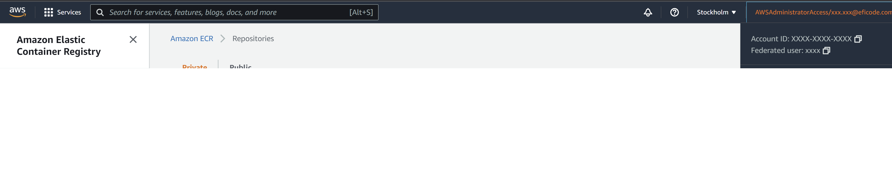

# Enabling access to the Kubernetes cluster from the command line

This guide allows you to allow access to the cluster from another AWS account, so the deployment user does not have to be used.

## Prequisities

Before following the steps written in this page, the following conditions must be fulfilled:

 - You must have an access to an AWS account (If using Eficode AWS, please use db-test AWS account and eu-north-1 AWS region).
 - You must have the AWS CLI installed (it is recommended to use the latest version: version 2).
    You can find the information here: [Installing, updating, and uninstalling the AWS CLI version 2](https://docs.aws.amazon.com/cli/latest/userguide/install-cliv2.html)
 - You must have configured the AWS CLI.
    You can follow the information on this page: [Configuring the AWS CLI - Configuration basics](https://docs.aws.amazon.com/cli/latest/userguide/cli-configure-quickstart.html)
 - You must have eksctl installed. You can follow the guide on [this page](https://docs.aws.amazon.com/eks/latest/userguide/eksctl.html) to install it
 - You must have the deployment user credentials available from [Generating an AWS Access Key for automatic deployment](./create_aws_user.md)

1. First, login to the AWS CLI using the deployment credentials. Use the command 
   ```
   aws configure
   ```
   to login with your AWS credentials. The wizard will ask you the required information. For the output format, json can be used.

2. 
   Create identity mapping for your AWS user with the underlying command. <IAM_USER_NAME> is the name of the AWS user that you want to enable access for. AWS users added to your account can be found [here](https://console.aws.amazon.com/iamv2/home#/users) <CLUSTER_NAME> is the name of your EKS cluster, it can be found from .env.deploy. <AWS_ACCOUNT_ID> is the ID of your AWS account, it can be found from the top right of the AWS console.

   

   ```bash
   eksctl create iamidentitymapping --cluster <CLUSTER_NAME> --arn arn:aws:iam::<AWS_ACCOUNT_ID>:user/<IAM_USER_NAME> --group system:masters --username <IAM_USER_NAME>
   ```